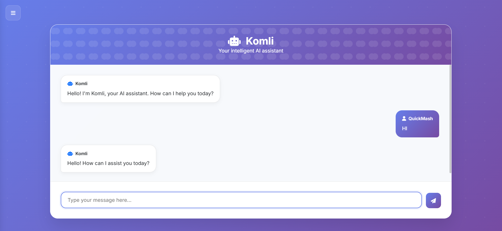

# Komli Frontend App




---

**Komli** is a conversational AI web app built with Python.

If you have any questions, feel free to DM me on Discord. My username is `quickmash`.

---

## How to Use
1. Run `/installer/installer.py` to edit configurations and, if needed, install Ollama.
2. Install your model by running:
   ```bash
   ollama run [Model Name]
   ```
3. Run the main application:
   ```bash
   python3 app.py
   ```

Use the installer located at `/installer/installer.py` for easy configuration editing.

---

## Komli 0.1.0 (Released)
- The first publicly available version.

**Warning:** If the `debug` setting at the bottom of the configuration file is set to `true`, set it to `false` before deployment.

---

## Komli 0.1.1 (In Development)
- Login support.
- Markdown rendering.
