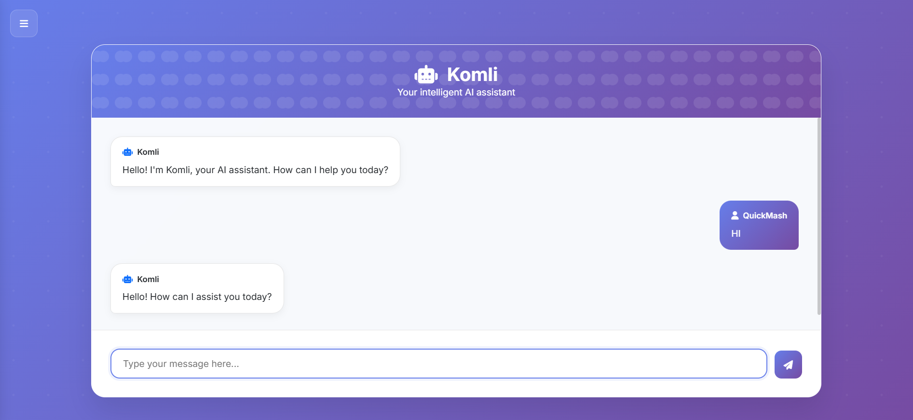

# Komli Frontend App

<p align="center">
   
</p>

<p align="center">
   <a href="https://github.com/QuickMash/Komli/commits"></a>
   <a href="https://github.com/QuickMash/Komli/tags"></a>
   <a href="https://github.com/QuickMash/Komli/commits"></a>
</p>

---

**Komli** is a conversational AI web application built with Python, designed for

---

** AI Being used on this **
Copilot being used? My friend challanged me to make AI with AI, so i thought this counted...

## 🚀 Getting Started

1. **Configure & Install Dependencies**
    - Run the installer to edit configurations and install [Ollama](https://ollama.com/) if needed:
       ```bash
       python3 /installer/installer.py
       ```
2. **Install Your Model**
    - Download your desired model:
       ```bash
       ollama pull [Model Name]
       ```
       (Dont forget to set it in the config)
3. **Launch the Application**
    - Start the main app:
       ```bash
       python3 app.py
       ```

> **Tip:** Use the installer at `/installer/installer.py` for easy configuration management.

---

## 📦 Release Notes

### Komli 0.2.0 _(In Development)_ - Planned Production Ready
- [ ] Admin Dashboard
- [ ] Theme support
- [x] Plugin support
- [ ] OAuth Support
- [ ] Support to upload images for profile pictures
- [ ] Allow users to limit their message length
- [ ] Support for multiple models (e.g., qwen:0.5b, qwen:1b, deepseek, etc.)
- [ ] Admin token limits (limit users)

#### Possible updates
- [ ] Payment support (Stripe)
- [ ] Hugging Face support 😀

### Komli 0.1.1 _(Released)_

### Komli 0.1.0 _(Released)_
- Initial public release

> **Warning:**  
> Before deployment, ensure the `debug` setting at the bottom of your configuration file is set to `false`.

---

## 💬 Support

For questions or support, feel free to DM `quickmash` on Discord.

---

